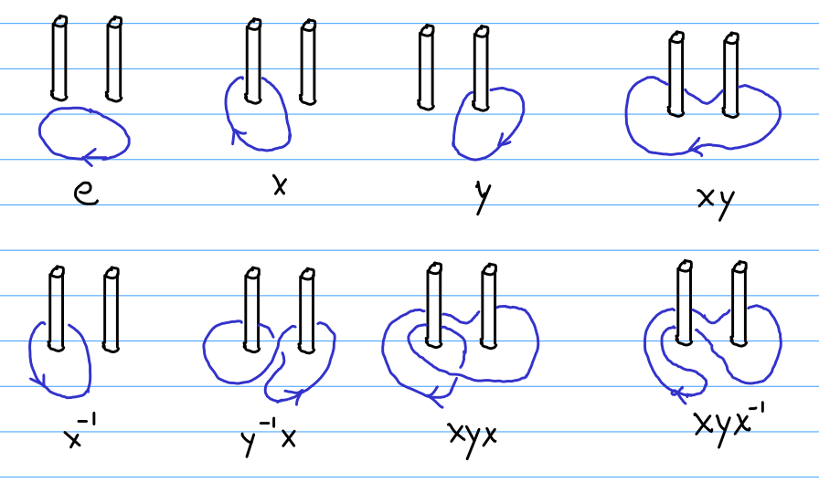

### Directions
Solve the following problems and type up your solutions.  Your solutions should be provided in one of the following formats (in order of preference)
* typed up in $$\LaTeX$$ and submitted as a PDF on Canvas
* written legibly on blank paper, scanned into a PDF and then uploaded on Canvas
* submitted to David X. Cohen to be included inconspicuously in an upcoming episode of The Simpsons.

If you go with the first strategy, you may wish to check out Overleaf which is a free and intuitive website for generating $$\LaTeX$$ documents online.
If you wish to use the second method and don't own a scanner at home, you can check out the numerous scanning apps available for smartphones.

**Problem 1:**
* (a) Find all Sylow $$3$$-subgroups of $$S_4$$.
* (b) Find all Sylow $$2$$-subgroups of $$S_4$$.

**Problem 2:**
* (a) For each integer $$n\leq 20$$ determine whether there is a nonabelian group of order $$n$$.  Explain.
* (b) For each integer $$n\leq 20$$ determine whether there is a non-cyclic group of order $$n$$.  Explain.

**Problem 3:** Show that if $$G$$ is a group of order $$1645$$, then $$G$$ is a cyclic group (and thus abelian).

**Problem 4:** Let $$G=\mathbb Z^3$$ and let $$H$$ be the subgroup of $$G$$ generated by $$(2,4,4)$$, $$(-6,6,12)$$ and $$(10,4,16)$$.
* (a) Calculate the Smith normal form of the matrix

$$\left(\begin{array}{cc}2 & 4 & 4\\ -6 & 6 & 12\\ 10 & 4 & 16\end{array}\right).$$

* (b) Find the finitely generated abelian group in invariant factor form that $$G/H$$ is isomorphic to.

**Problem 5:** Let $$G = F(\{x,y\})$ be the free group on two generators $$x$$ and $$y$$.
We can understand the free group on two generators in terms of a loop of rope knotted around two posts stuck in the yard, as shown in the figure below.

* (a) Draw a picture corresponding to the element $$xy^{-1}$$
* (b) Draw a picture corresponding to the element $$xyxy$$
* (c) Find an element of $$G$$ different from the identity satisfying the property that if we pull up either one of the two posts, then the loop is no longer wrapped around the remaining post.

