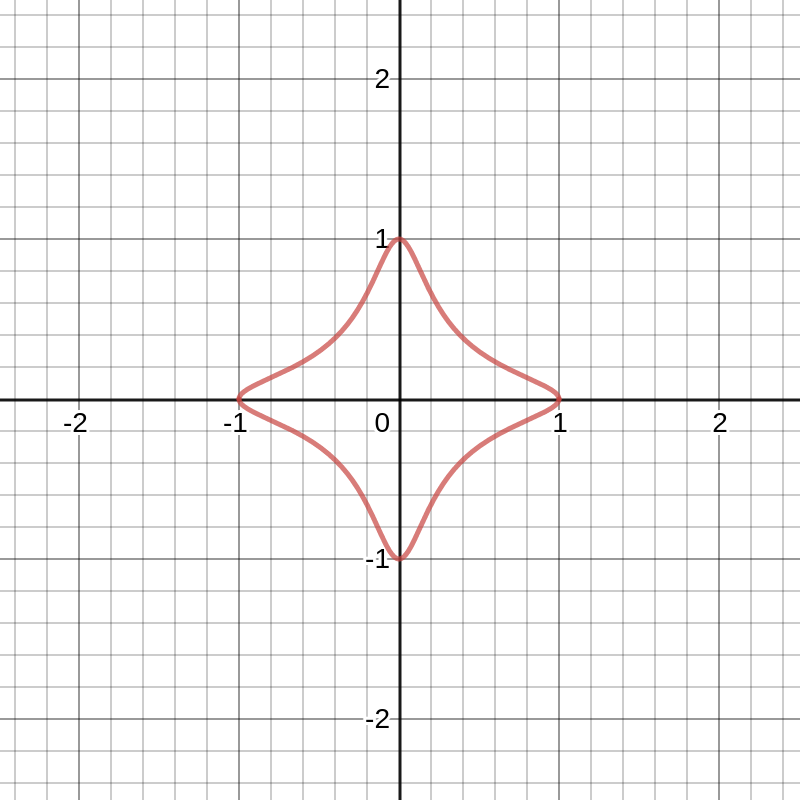

An **algebraic equation** is an equation of the form

$$p(x_1,\dots, x_n) = 0$$

for some multivariate polynomial $$p$$ in unknown variables $$x_1,\dots, x_n$$.  The set of solutions to this equation is denoted by $$Z(p)$$ (we use "Z" for zeros).  In order to learn more about what solutions of algebraic equations look like and how such equations may be solved, mathematicians study various properties of the system of equations such as automorphisms.

**Definition:** An **automorphism** of the $$Z(p)$$ is a set of rational functions $$\rho_1(x_1,\dots,x_n),\dots,\rho_n(x_1,\dots,x_n)$$ in variables $$x_1,\dots,x_n$$ such that

$$\rho(x_1,x_2,\dots, x_n) = (\rho_1(x_1,\dots,x_n),\dots,\rho_n(x_1,\dots,x_n))$$

defines a bijection from $$Z(p)$$ to itself.

The set $$\text{Aut}(p)$$ of automorphisms of $$Z(p)$$ forms a group under composition!  In particular,
* the composition of two automorphisms is another automorphism
* there the identity element $$\rho_1(x_1,\dots,x_n) = x_1,\dots,\rho_n(x_1,\dots,x_n) = x_n$$
* inverses exist

We will look at two interesting cases of this, starting with a one-variable case and then extending to a multi-variable case.
In the single-variable case, this group is closely related to another group we will discuss later called the [Galois Group](https://en.wikipedia.org/wiki/Galois_group).

### Roots of unity
An **$$n$$'th root of unity** is a solution $$z$$ of the algebraic equation

$$z^n = 1.$$

Thus the roots of unity are precisely the elements of $$Z(p)$$ for $$p(z) = z^n-1$$.  For any integer $$k$$ relatively prime to $$n$$, the rational function $$\rho_k(z) = z^k$$ defines an automorphism of $$Z(p)$$.  To see this, simply note that if $$z^n=1$$, then

$$\rho_k(z)^n = (z^k)^n = z^{nk} = 1^k = 1.$$

therefore $$\rho_k$$ maps $$Z(p)$$ to itself.  The fact that this map is bijective comes from the restriction that $$k$$ and $$n$$ are relatively prime.
In fact, this characterizes the automorphisms of $$Z(p)$$:

$$\text{Aut}(p) = \{\rho_k(z) : \text{$k$ and $p$ are relatively prime}\}.$$

Note that by restricting these maps to $$Z(p)$$, we obtain the Galois group of the field extension corresponding to $$p(z)$$.

### Edwards curve
An Edwards curve in $$\mathbb R^2$$ is the curve consisting of the points $$(x,y)$$ in $$\mathbb R^2$$ satsifying the equation

$$x_1^2 + x_2^2 = 1 - ax_1^2x_2^2$$

for some $$a\geq 0$$.  Thus the Edwards curve is $$Z(p)$$, for $$p(x_1,x_2) = x_1^2+x_2^2+ax_1^2x_2^2-1$$.  Note that in the special case $$a=0$$ this is simply a circle and for general $$a$$, this looks like a circle being squeezed at four different points.

The Edwards curve is extremely interesting in the sense that every point on the curve actually defines an automorphism of the curve!  Specifically, if $$(y_1,y_2)$$ is a point on the curve then 

$$\rho_{(y_1,y_2)}(x_1,x_2) = \left(\frac{x_1y_2+x_2y_1}{1-ax_1x_2y_1y_2},\frac{x_2y_2-x_1y_1}{1+ax_1x_2y_1y_2}\right)$$

One can manually check that this maps points of $$Z(p)$$ to other points of $$Z(p)$$.  Additionally, $$\rho_{(0,1)}$$ is the identity and $$\rho_{(-x_1,x_2)}$$ is the inverse of $$\rho_{(x_1,x_2)}$$.  In this way, the set of points on the Edwards curve itself has a group structure, where we define

$$(x_1,x_2) + (y_1,y_2) = \rho_{(y_1,y_2)}(x_1,x_2).$$

This is a special case of a very important family of algebraic equations defining **elliptic curves**.

