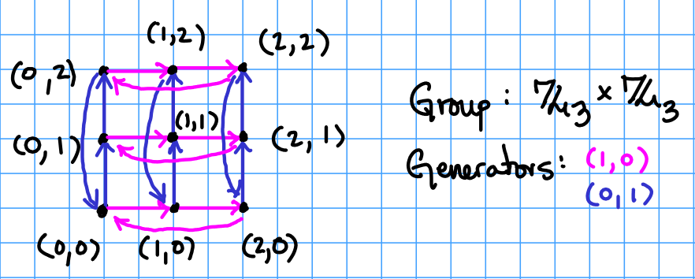
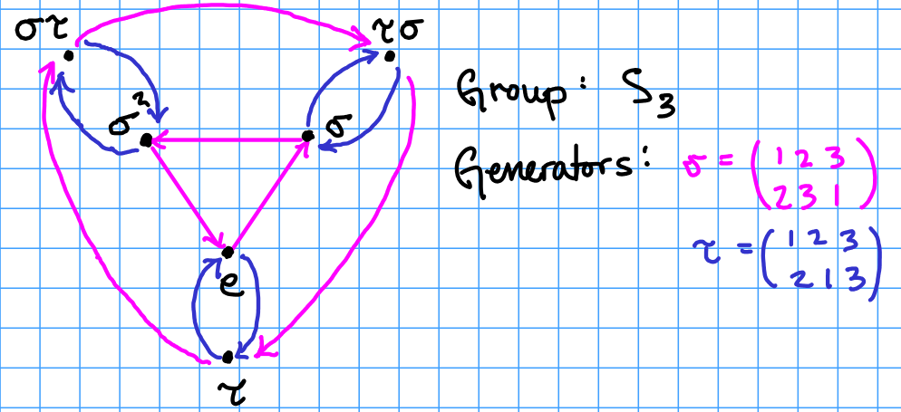

## Generating sets

Let $$G$$ be a group with binary operation $$*$$.

Given a pair of elements $$a,b\in G$$, there are many different products that we can from using $$a$$ and $$b$$ and their inverses:

$$a*b*a,\quad a^2*b*a^3*b*a*b^{-1},\quad\text{and so on}$$

If every element $$G$$ can be expressed this way, we say that $$a$$ and $$b$$ are **generators of $$G$$**.  Equivalently, we can say that the set $$\{a,b\}$$ generates $$G$$.  More generally, we can similarly define what it means for any set of elements of $$G$$ to generate $$G$$.  However, in order to make this rigorous, we need to think about intersections.

**Proposition:** Let $$\Lambda \subseteq\mathcal P(G)$$ be a non-empty set of subgroups of $$G$$.  Then the intersection

$$\bigcap_{H\in\Lambda} H = \{x\in G: x\in H\ \text{for all $H\in\Lambda$}\}$$

**Theorem:** Let $$S\subseteq G$$ be a subset of $$G$$ and set

$$\langle S\rangle = \{x\in G: x\in H\ \text{for all $H\leq G$ with $S\subseteq H$}\}.$$

Then $$\langle S\rangle$$ is a subgroup of $$G$$.

**Proof:**  Define $$\Lambda = \{H\leq G: S\subseteq H\}$$.  Then $$H = \bigcap_{K\in \Lambda}K$$.

**Definition:** $$\langle S\rangle$$ is called the **subgroup generated by $$S$$**.  If $$G = \langle S\rangle$$ then we say that **$$G$$ is generated by $$S$$**.  If $$S$$ is a finite set, then we say that $$G$$ is **finitely generated**.

**Example:**  The group $$\mathbb Q$$ with the binary operation $$+$$ is not finitely generated.

**Example:** The Dihedral group

$$D_n = \{(a,i): a\in\mathbb Z_n\ \text{and}\ i=\pm 1\},\quad (a,i)*(b,j) = (a*j+b,i*j).$$

is generated by $$\{(1,1),(0,-1)\}$$.

**Example:** The symmetric group $$S_n$$ is generated by **two-cycles**

$$(j\ k): m\mapsto \left\lbrace\begin{array}{cc}
k & m=j\\
j & m=k\\
m & \text{otherwise}
\end{array}\right.$$

## Cayley Graphs

If $$G$$ is a group and $$S$$ is a subgroup of $$G$$, we can gain a great deal of insight by visualizing *how* $$S$$ generates $$G$$.  One way to do so is to construct a **Cayley digraph**.

**Definition:** The **Cayley digraph** of a group $$G$$ with generating set $$S$$ is the graph whose vertices are the elements of $$G$$, and where there is an arrow from $$a\in G$$ to $$b\in G$$ precisely when there is an element $$c\in S$$ with $$c*a = b$$.

We can enhance this visualization by color coding or labeling the edges, so as to see which generator is responsible for each connection.

