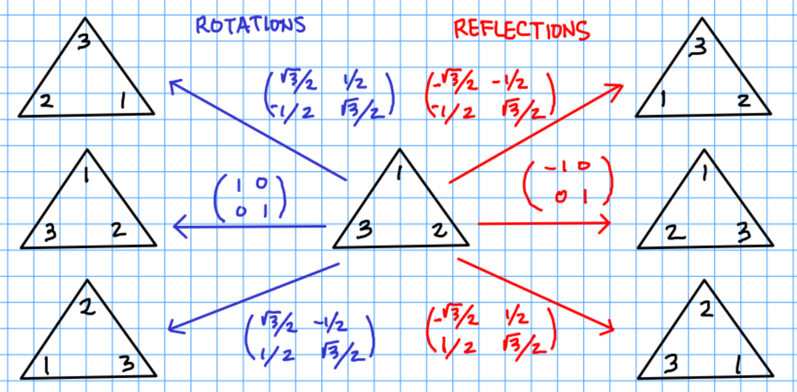

One of the historic origins of groups comes from the study of the symmetries of a subset of $$\mathbb R^n$$.  For simplicity, we will focus on studying symmetries in the $$x,y$$-plane.

To start, consider a regular convex polygon $$\mathcal P$$ in the real plane $$\mathbb R^2$$, centered at the origin.  A **(linear) symmetry** of $$\mathcal P$$ is a linear transformation from $$\mathbb R^2$$ to itself which maps $$\mathcal P$$ to itself.  Any linear transformation can be represented as a $$2\times 2$$ matrix in terms of the canonical basis for $$\mathbb R^2$$, so these symmetries will really be special matrices.  Let's check out some special cases.

### Symmetries of an isoceles triangle
Consider the solid triangle $$\mathcal T$$ with vertices $$(0,1)$$, $$(-\sqrt{3}/2,-1/2)$$, and $$(\sqrt{3}/2,1/2)$$.  There are precisely six linear symmetries for the isoceles triangle, namely

* three rotation matrices

$$
R_0        = \left(\begin{array}{cc}1&0\\0&1\end{array}\right),\quad 
R_{2\pi/3} = \left(\begin{array}{cc}\frac{1}{2}&-\frac{\sqrt{3}}{2} \\ \frac{\sqrt{3}}{2}&\frac{1}{2}\end{array}\right),\quad
R_{4\pi/3} = \left(\begin{array}{cc}\frac{1}{2}& \frac{\sqrt{3}}{2} \\-\frac{\sqrt{3}}{2}&\frac{1}{2}\end{array}\right)
$$

* three reflection matrices

$$
S_0        = \left(\begin{array}{cc}-1&0\\0&1\end{array}\right),\quad 
S_{2\pi/3} = \left(\begin{array}{cc}-\frac{1}{2}&\frac{\sqrt{3}}{2} \\ \frac{\sqrt{3}}{2}&\frac{1}{2}\end{array}\right),\quad
S_{4\pi/3} = \left(\begin{array}{cc}-\frac{1}{2}&-\frac{\sqrt{3}}{2} \\-\frac{\sqrt{3}}{2}&\frac{1}{2}\end{array}\right)
$$

Graphically, these are realized as

### Symmetries of the square
To begin, let's think about the filled-in square $$\mathcal S = [-1,1]\times[-1,1]$$ centered at the origin.  A **(linear) symmetry** of $$\mathcal S$$ is a linear transformation $$T: \mathbb R^2\rightarrow\mathbb R^2$$ which maps $$\mathcal S$$ to itself.  For example, rotations are linear transformations and rotation by $$90$$ degrees preserves the square, so a $$90$$-degree clockwise rotation is a symmetry of $$\mathcal S$$.  This transformation can be represented as a function

$$T(x,y) = (y,-x)$$

or in terms of a $$2\times 2$$ matrix

$$\left(\begin{array}{cc}
0& 1\\
-1 & 0
\end{array}\right).$$

The set $$G$$ of all symmetries of $$\mathcal S$$ consists (in matrix notation) of
- identity

$$
\left(\begin{array}{cc}
1 & 0\\
0 & 1
\end{array}\right)
$$

- rotations

$$
\left(\begin{array}{cc}
0& 1\\
-1 & 0
\end{array}\right),\quad
\left(\begin{array}{cc}
-1& 0\\
 0&-1
\end{array}\right),\quad
\left(\begin{array}{cc}
0&-1\\
1 & 0
\end{array}\right)
$$

- reflections

$$
\left(\begin{array}{cc}
1 & 0\\
0 &-1
\end{array}\right),\quad
\left(\begin{array}{cc}
-1& 0\\
 0& 1
\end{array}\right),\quad
\left(\begin{array}{cc}
0 & 1\\
1 & 0
\end{array}\right),\quad
\left(\begin{array}{cc}
 0 & -1\\
-1 & 0
\end{array}\right).
$$

This collection of $$8$$ matrices forms a group, sometimes called the **dihedral group** $$D_4$$.  More generally, one can consider the group of symmetries of an $$n$$-gon on the plane, obtaining the dihedral group $$D_n$$.  In fact, we can extend this to higher dimensions and consider the symmetry groups of various polytopes, forming even more interesting groups.

